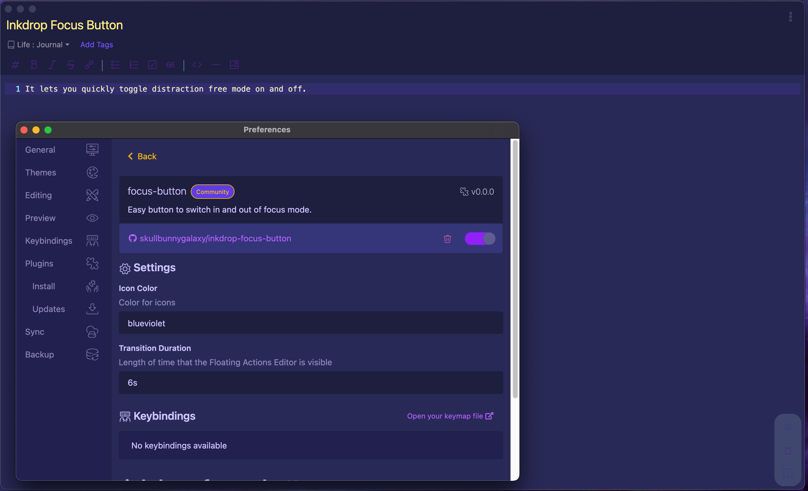

# inkdrop-focus-button

This plugin for Inkdrop adds a button to editor floating actions in the lower right hand corner for easily switching between distraction free mode and back. 

- Config settings allow you to edit the color of the editor floating buttons and adjust the duration that the button stays at full opacity. - Opacity of button is adjusted to 0.2, which makes it always present.

